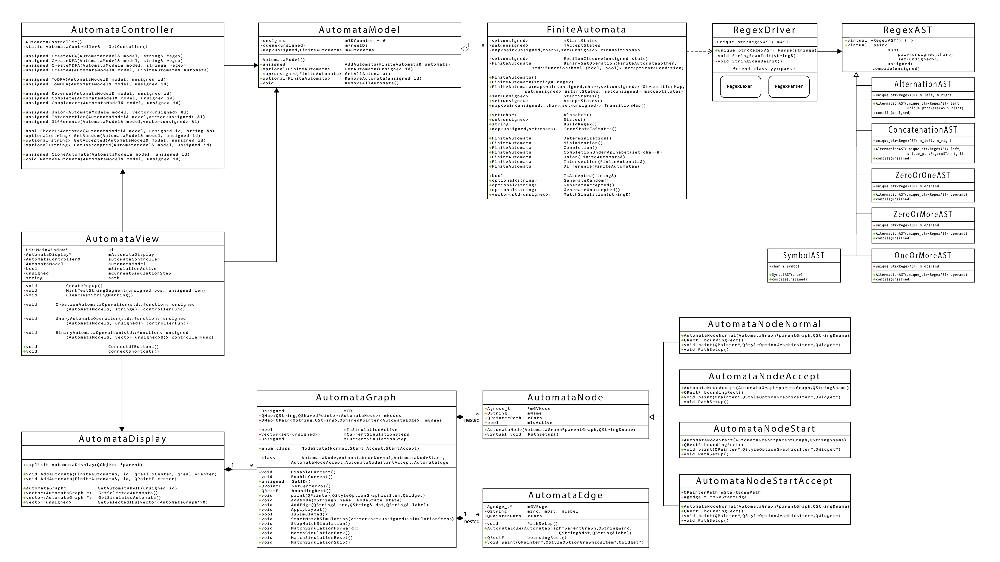
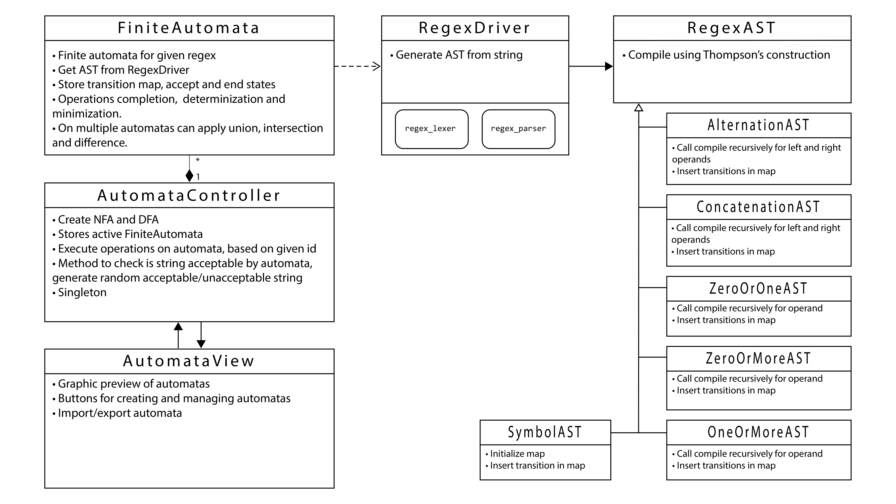
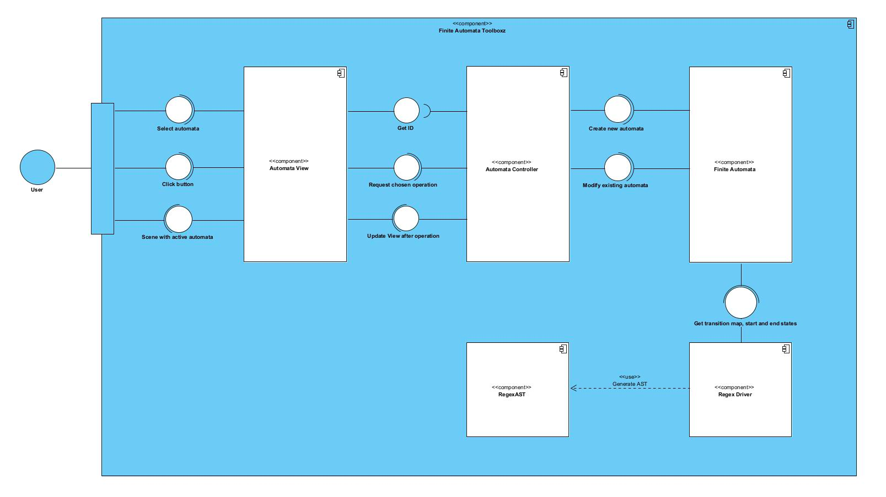
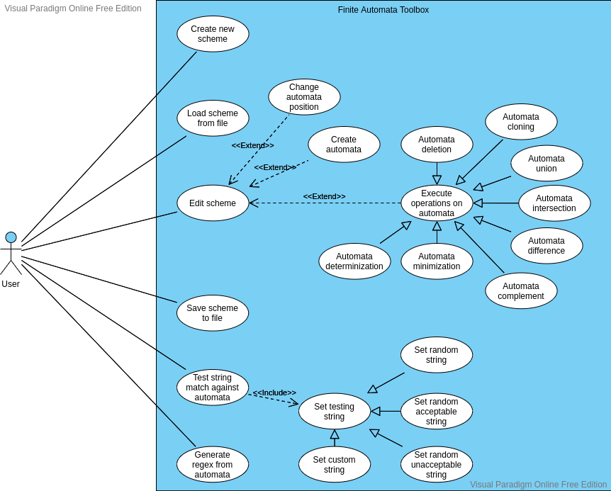
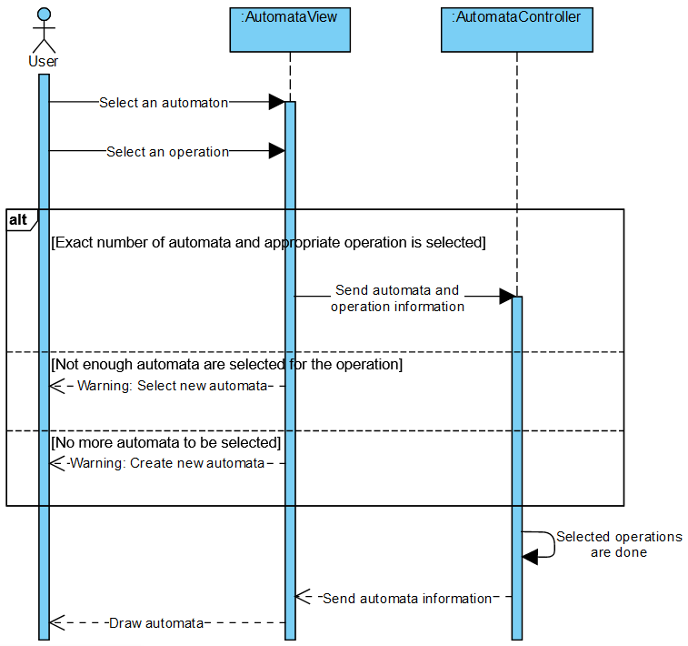
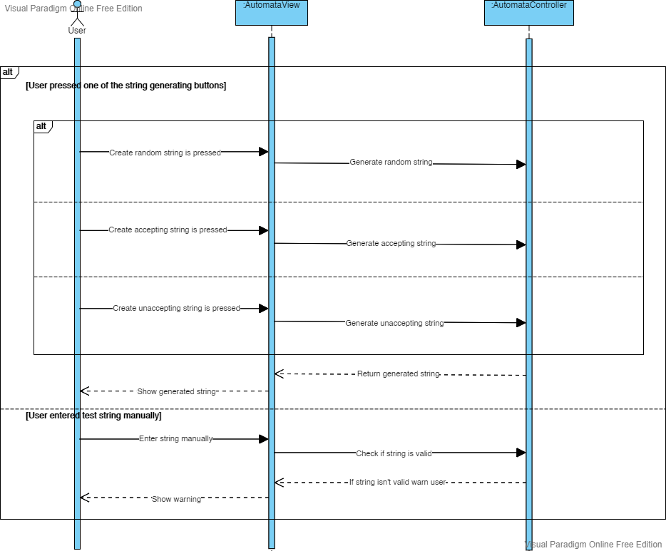
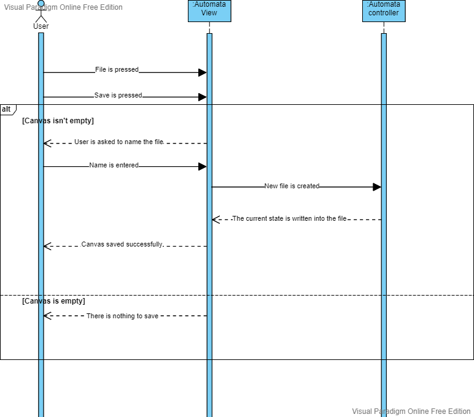

# Documentation

## Description:
Finite Automata Toolbox is a program with the goal of providing an easy to use interface to various algorithms commonly used with finite automata.

The user is presented with an interactable scene (or canvas) which displays the graph representation of constructed automatons. The graphs are selectable and draggable across the scene.

The other major part of the interface is an action panel consisting of multiple tabs (namely, the Creation, Operations and Testing tab). Each tab offers an interface for executing different actions on finite automatons, such as:

+ Creation tab
	+ Automaton construction from regex
	+ Automaton construction from serialized input
+ Operations tab
	+ Determinization, minimization and completion of selected automaton
	+ Union, intersection and difference of selected automata
+ Testing tab
	+ Custom or random (acceptable or unacceptable) string generation and matching simulation on selected automaton
	
The program also offers the option of saving the current scene for later editing or sharing, or loading a scene from a file.

## UML:

### Structure Diagrams:

#### Class Diagram:

<!-- #### Class Diagram Description:

#### Component Diagram:
 -->

### Behaviour Diagrams:

#### Use Case Diagram:

#### Use Cases:

## Create automata

1. Description:
    + The user can create a finite automaton and add its graph representation to the scene.
2. Actor:
    + User
3. Precondition:
    + Application is running.
    + The "Creation" tab is active.
4. Postcondition:
    + A new finite automaton is created and placed on the scene.
5. Standard process:
    + The user inputs a regular expression in the appropriate line edit in the creation tab.
    + The user clicks on one of the automaton creation buttons.
        + The controller creates a NFA.
        + If the user clicked the "Create NFA" button, a new NFA should be created.
            + The NFA is stored in the model.
        + If the user clicked the "Create DFA" button, a new DFA should be created.
            + The NFA is determinized.
            + The DFA is stored in the model.
        + If the user clicked the "Create MDFA" button, a new MDFA should be created.
            + The NFA is minimized.
            + The MDFA is stored in the model.
    + The view fetches the newly created automaton data from the model.
    + The view creates a graph representation of the automaton and places it on the scene.
6. Alternative processes:
    + A1: Invalid regex format. The application informs the user that the regex format is invalid with a warning popup.

## Execute operations on automata

1. Description: The user sets operations (minimisation, determinisation, intersect, difference, complement, union) that are implemented on an automaton.
2. Actor:
	+ The User 
3. Precondition: 
	+ The program is running and "Operations" tab is selected.
	+ At least one finite state automaton is created.
4. Postcondition: 
	+ A modified automata (automaton) is placed on the scene.
5. Event flow:
	+ The user selects on a canvas an automaton that the operations should be done on.
	+ The user selects which operation is to be done by checking checkboxes with operation names attached to them.
	+ The program verifies if the number of selected finite state automata is enough for an operation to be done.
		+ If only one finite state automaton is selected and the operation chosen is either union, intersection or difference, then the chosen operation could not be done and use case advances to next step.
		+ If there are no more finite state automata to be selected for that operation to be completed, use case advances to alternative flow A2.
		+ If the number of selected finite state automata is appropriate (1 for complement, determinisation and minimisation, 2 for union, interesection and difference), use case proceeds.
	+ Selected operations are done.
	+ The program draws a finite state automaton that represents the result of a selected operation.
6. Alternative flow:
	+ A1. Unexpected exit of the application - If the program is suddenly closed, all saved information are discarded and use case ends.
	+ A2. Not enough finite state automata are created - The user is warned that there are not enough finite state automata created for that operation to be completed and is prompted to return to "Creation" tab where a new finite state automaton should be created. After the creation, use case goes back to beginning.
		
##

## Test string match against automata
1. Description:
    + The User can check if the string is accepted by active automata.
2. Actor:
    + User
3. Precondition:
    + The application is running.
    + The "Test" tab is active.
    + At least one created automata.
    + Set test string.
4. Postcondition:
    + The User is informed if the string is accepted or unaccepted.
5. Standard process:
    + The User uses case: “Set test string”.
    + The User selects desired automata.
    + When The Actor press button play:
        + The application determinizes the automata.should be created.
        + The application traverses through transition map.
        + The application checks if last state:
            + is in the set of end states:
                + The application informs the user that the string is accepted.
            + is not in the set of end states:
                + The application informs the user that the string is unaccepted.
6. Alternative processes:
    + /

#

## Generating random test string
1. Description    
    + User can randomly generate or type a string used to test his automata  
2. Actors
    + User
3. Precondition
    + Application is running
    + "Testing" tab is open
    + Automata is created and selected
4. Postcondition
    + User has a string which is usable in testing automata
5. Standard process
    + User presses one of the string generating buttons
        + If "Generate random string" button was pressed application will generate completely random string comprised of letters in selected automata's alphabet 
        + If "Generate acceptable string" button was pressed application will generate random string comprised of letters in selected automata's alphabet that results in successful automata traversal
        + If "Generate unacceptable string" button was pressed application will generate random string comprised of letters in selected automata's alphabet that results in failed automata traversal
    + User proceeds to test given string (See 'Testing random string' diagram)
6. Alternative processes
    + User enters the test string manually
    + Application checks if entered string is valid (comprised only of selected automata's alphabet) and warns user if it's not

#

## Save finite automata to file

1. Description: 
    + The user saves the current state of the canvas to a file.
2.  Actor:
    + The User 
3. Precondition: 
    + The program is running.
    + At least one finite automaton is created.
4. Postcondition: 
    + A new .fat file containing the canvas is created which can be loaded into the program. 
5. Event flow:
    + The user presses the File tab.
    + The user clicks "Save".
    + The program verifies that the canvas isn't empty.
    + The user is asked to set a name for the save file.
    + A new .fat file is created and the current state of the canvas is written into it.
6. Alternative flow:
    + The canvas is empty 
    + The user is warned that a blank canvas cannot be saved and no files are created.

#

