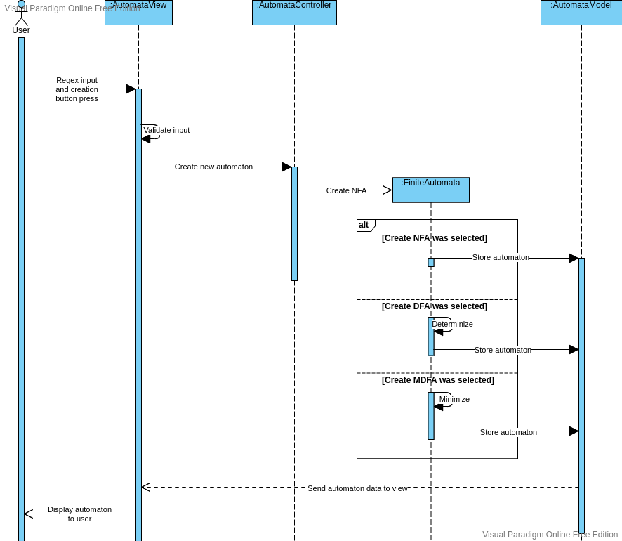

## Create automata

1. Description:
    + The user can create a finite automaton and add its graph representation to the scene.
2. Actor:
    + User
3. Precondition:
    + Application is running.
    + The "Creation" tab is active.
4. Postcondition:
    + A new finite automaton is created and placed on the scene.
5. Standard process:
    + The user inputs a regular expression in the appropriate line edit in the creation tab.
    + The user clicks on one of the automaton creation buttons.
        + The controller creates a NFA.
        + If the user clicked the "Create NFA" button, a new NFA should be created.
            + The NFA is stored in the model.
        + If the user clicked the "Create DFA" button, a new DFA should be created.
            + The NFA is determinized.
            + The DFA is stored in the model.
        + If the user clicked the "Create MDFA" button, a new MDFA should be created.
            + The NFA is minimized.
            + The MDFA is stored in the model.
    + The view fetches the newly created automaton data from the model.
    + The view creates a graph representation of the automaton and places it on the scene.
6. Alternative processes:
    + A1: Invalid regex format. The application informs the user that the regex format is invalid with a warning popup.

