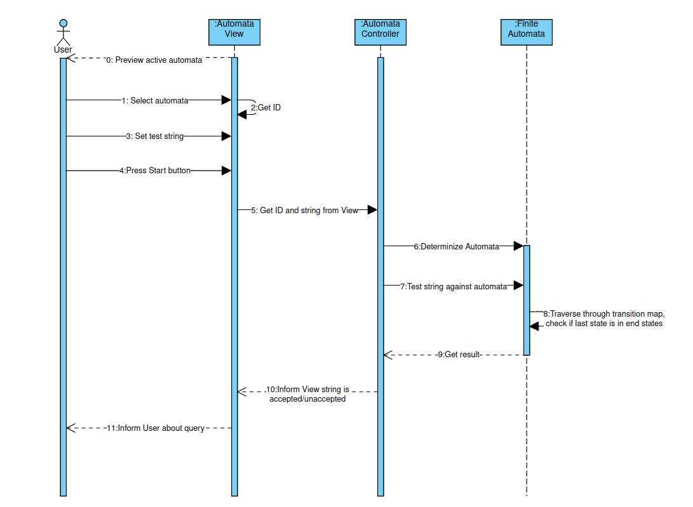

## Test string match against automata
1. Description:
    + The User can check if the string is accepted by active automata.
2. Actor:
    + User
3. Precondition:
    + The application is running.
    + The "Test" tab is active.
    + At least one created automata.
    + Set test string.
4. Postcondition:
    + The User is informed if the string is accepted or unaccepted.
5. Standard process:
    + The User uses case: “Set test string”.
    + The User selects desired automata.
    + When The Actor press button play:
        + The application determinizes the automata.should be created.
        + The application traverses through transition map.
        + The application checks if last state:
            + is in the set of end states:
                + The application informs the user that the string is accepted.
            + is not in the set of end states:
                + The application informs the user that the string is unaccepted.
6. Alternative processes:
    + /

#

